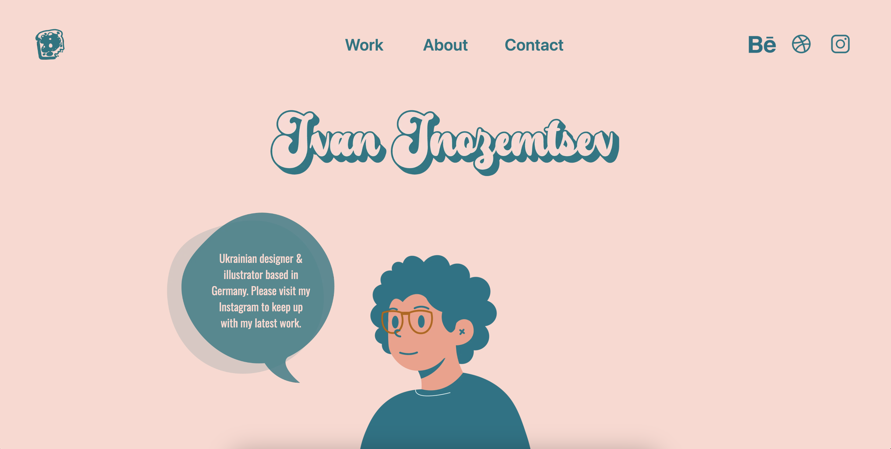

# Designer and Illustrator Portfolio Website 👨🏻‍💻

This is a live portfolio website showcasing the work of a designer and illustrator. The website is designed to highlight the skills, experience, and projects of the designer and illustrator, providing an interactive and visually appealing experience for visitors.

## Features

- Responsive design: The website adapts to different screen sizes and devices, ensuring a seamless browsing experience.
- Project gallery: A visually appealing gallery of the designer's and illustrator's projects, showcasing their variety of work.
- About section: Information about the designer and illustrator, including their background, skills, and artistic style.
- Contact information: A contact form or links to social media profiles, allowing visitors to reach out and connect with the designer and illustrator.

## Technologies Used

- React
- HTML
- SCSS(SASS)
- JavaScript

## Visit the website by the following link

https://inozemtsevco.com/

## Preview

